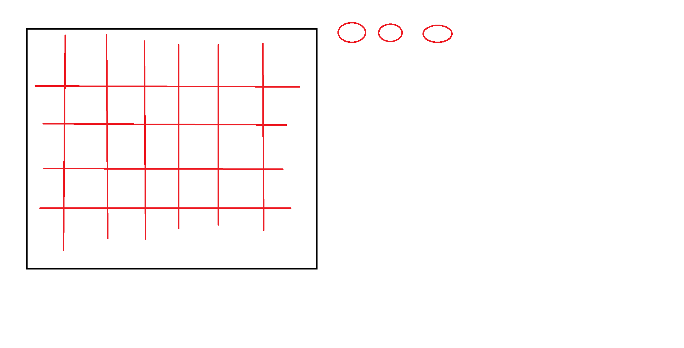

#   Homework на каникулы

## Минёр

Сделать поле(10x10, 20x20, 30x30) для игры в минёра. Желательно не такое как у других. Весёленькое. Использовать современную вёрстку. Пример минёров minesweeperonline.com

## Фибоначчи

1. Нарисовать [дерево Fibonacci](https://janemouse.livejournal.com/1412435.html), сфотографировать и выслать мне на емайл.
2. https://www.youtube.com/watch?v=ahXIMUkSXX0  посмотреть видео
3. Прочитать про золотую спираль, например [здесь](https://ru.wikipedia.org/wiki/%D0%97%D0%BE%D0%BB%D0%BE%D1%82%D0%B0%D1%8F_%D1%81%D0%BF%D0%B8%D1%80%D0%B0%D0%BB%D1%8C)
4. Биография Леонардо Пизанского - [тут](https://ru.wikipedia.org/wiki/%D0%A4%D0%B8%D0%B1%D0%BE%D0%BD%D0%B0%D1%87%D1%87%D0%B8)
5. [Числа Фибоначчи](https://ru.wikipedia.org/wiki/%D0%A7%D0%B8%D1%81%D0%BB%D0%B0_%D0%A4%D0%B8%D0%B1%D0%BE%D0%BD%D0%B0%D1%87%D1%87%D0%B8#:~:text=0%2C%201%2C%201%2C%202,%D1%80%D0%B0%D0%B2%D0%BD%D0%BE%20%D1%81%D1%83%D0%BC%D0%BC%D0%B5%20%D0%B4%D0%B2%D1%83%D1%85%20%D0%BF%D1%80%D0%B5%D0%B4%D1%8B%D0%B4%D1%83%D1%89%D0%B8%D1%85%20%D1%87%D0%B8%D1%81%D0%B5%D0%BB.)

## Системы счисления

1. [Троичный компьютер
   ](https://ru.wikipedia.org/wiki/%D0%A2%D1%80%D0%BE%D0%B8%D1%87%D0%BD%D1%8B%D0%B9_%D0%BA%D0%BE%D0%BC%D0%BF%D1%8C%D1%8E%D1%82%D0%B5%D1%80)
2. [Шестнадцатеричная система](https://ru.wikipedia.org/wiki/%D0%A8%D0%B5%D1%81%D1%82%D0%BD%D0%B0%D0%B4%D1%86%D0%B0%D1%82%D0%B5%D1%80%D0%B8%D1%87%D0%BD%D0%B0%D1%8F_%D1%81%D0%B8%D1%81%D1%82%D0%B5%D0%BC%D0%B0_%D1%81%D1%87%D0%B8%D1%81%D0%BB%D0%B5%D0%BD%D0%B8%D1%8F)
3. [Двадцатиричная система](https://ru.wikipedia.org/wiki/%D0%94%D0%B2%D0%B0%D0%B4%D1%86%D0%B0%D1%82%D0%B5%D1%80%D0%B8%D1%87%D0%BD%D0%B0%D1%8F_%D1%81%D0%B8%D1%81%D1%82%D0%B5%D0%BC%D0%B0_%D1%81%D1%87%D0%B8%D1%81%D0%BB%D0%B5%D0%BD%D0%B8%D1%8F)
4. [Шести десятеричная](https://ru.wikipedia.org/wiki/%D0%A8%D0%B5%D1%81%D1%82%D0%B8%D0%B4%D0%B5%D1%81%D1%8F%D1%82%D0%B5%D1%80%D0%B8%D1%87%D0%BD%D0%B0%D1%8F_%D1%81%D0%B8%D1%81%D1%82%D0%B5%D0%BC%D0%B0_%D1%81%D1%87%D0%B8%D1%81%D0%BB%D0%B5%D0%BD%D0%B8%D1%8F)
5. [Двенадцатеричная система счисления](https://ru.wikipedia.org/wiki/%D0%94%D0%B2%D0%B5%D0%BD%D0%B0%D0%B4%D1%86%D0%B0%D1%82%D0%B5%D1%80%D0%B8%D1%87%D0%BD%D0%B0%D1%8F_%D1%81%D0%B8%D1%81%D1%82%D0%B5%D0%BC%D0%B0_%D1%81%D1%87%D0%B8%D1%81%D0%BB%D0%B5%D0%BD%D0%B8%D1%8F)
6. [Цифры майя](https://ru.wikipedia.org/wiki/%D0%A6%D0%B8%D1%84%D1%80%D1%8B_%D0%BC%D0%B0%D0%B9%D1%8F)
7. [Пример применения](https://smallseotools.com/de/rgb-to-hex/)
 
